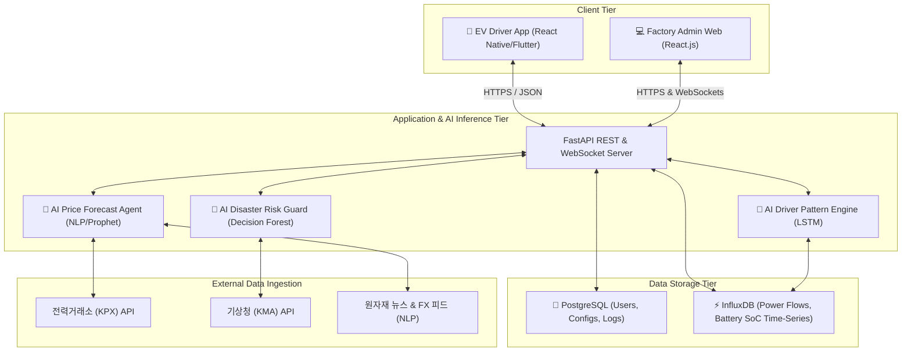

# Smart Energy & Safety Guard Platform Architecture Spec
### AI 기반 산업단지형 스마트 에너지 물가 최적화 및 세이프티 가드 플랫폼 아키텍처 명세서

본 문서는 플랫폼의 하이레벨 아키텍처 설계, 모듈 간 데이터 파이프라인, 그리고 AI 에이전트와 데이터베이스 간의 동적 연동 매커니즘을 정의합니다.

---

## 1. System Topology (시스템 구성도)

플랫폼은 크로스플랫폼 모바일 앱(EV 차주용), 리액트 기반 웹 대시보드(공장 관리자용), 그리고 고성능 AI 추론 엔진 및 데이터 가공을 담당하는 Python FastAPI 백엔드로 이루어져 있습니다. 데이터 계층은 구조화된 관계형 데이터(PostgreSQL)와 대용량 전력 시계열 데이터(InfluxDB)의 하이브리드 결합 모델을 채택합니다.

---

## 2. Core Modules & Data Pipelines

### A. VPP 에너지 물가 최적화 파이프라인
1. **뉴스 감성 분석 및 글로벌 환율 수집 (NLP Pipeline)**:
   - AI 에이전트는 HuggingFace `SentenceTransformer` 및 LlamaIndex/LangChain을 통해 중동 에너지 이슈, 원자재 뉴스, 원/달러 환율 추세를 주기적으로 크롤링 및 파싱합니다.
   - 텍스트 감성 지수(-1.0 ~ 1.0)와 경제 변수를 결합하여 다중 선형 회귀 또는 Prophet 시계열 모델의 가중 피처(Feature)로 주입합니다.
2. **단가 예측 산출**:
   - `price_predictions` 테이블에 3개월 물가 변동 전망을 기록합니다.
   - 전라남도/제주도의 재생에너지(태양광·풍력) 발전량 예측치(일사량, 풍속 데이터 기준)를 분석하여 출력제어 발생 시점의 초저가 충전 마진을 확정합니다.

### B. EV 생활패턴 학습 & 자동 스케줄러 파이프라인
1. **패턴 학습**:
   - 전기차의 위치 정보(GPS)와 충전 케이블 삽입 여부(Grid Connection) 이력이 InfluxDB 시계열 데이터베이스에 초 단위로 기록됩니다.
   - LSTM 기반의 SoC(State of Charge) 예측 모형이 운전자의 주행 습관, 주중 출퇴근 패턴, 사내 주차 지속 시간을 프로파일링하여 최적의 VPP 참여 가용 시간대를 추출합니다.
2. **자동 스케줄링 및 스마트 알림**:
   - VPP 관제 에이전트가 "내일 낮 12시 잉여 전력 흡수를 위해 충전 단가 70% 인하" 프로모션을 결정하면, 해당 시간대에 사내 주차 예정인 운전자들에게 타겟팅 푸시 알림을 발송합니다.
   - 운전자가 승인하면 스케줄러 테이블에 자동 등록되어, 차량이 플러그인 되었을 때 별도 조작 없이 충전기가 제어(Charge/Discharge)됩니다.

### C. 세이프티 가드 (Safety Guard) 긴급 차단 파이프라인
1. **재해 예방 트리거**:
   - 공장의 온도 센서, 기상청 특보 API(폭우/태풍 경보)가 웹소켓 혹은 이벤트 브로커(Kafka/RabbitMQ)를 통해 실시간 수집됩니다.
   - 위험 지수 계산 모듈이 침수 위험 및 ESS 배터리 발열 수치를 체크합니다.
2. **동적 출력 제어 및 알림**:
   - 리스크 지수가 경고 단계를 초과하면, 백엔드는 V2G 역송전 및 ESS 충방전 회로의 스위치 릴레이 제어 명령을 즉각 전송하여 출력을 최대 40%로 긴급 락(Lock)합니다.
   - 동시에 현장 안전 수칙(SOP)을 현장 관리자 및 근무자 스마트폰으로 SMS/푸시로 다중 발송하여 안전 사고를 철저히 예방합니다.

---

## 3. Database Table Relationships (ERD Mapping)

PostgreSQL 관계형 스키마 설계에 근거한 엔티티 연동 아키텍처는 다음과 같습니다.

1. **`users` ➔ `ev_details` (1:N)**:
   - 한 명의 사용자는 여러 대의 EV 차량을 플랫폼에 등록할 수 있으며, 주행 패턴 프로필은 차량 식별키(`ev_details.id`) 기준으로 추적됩니다.
2. **`ev_details` ➔ `ev_status` (1:N 시계열)**:
   - 차량의 실시간 SoC 변화 및 충방전 상태는 대용량 시계열 이력으로 누적되어 AI LSTM 모델 학습의 기초 데이터셋으로 사용됩니다.
3. **`users` ➔ `factory_ess` (1:N)**:
   - 공장 관리자는 담당 산업단지의 대용량 ESS 인프라를 연결하여 충방전 임계값 및 물가 물량 가동률을 관리합니다.
4. **`factory_ess` ➔ `safety_logs` (1:N)**:
   - 특정 ESS 및 공장 단지에서 기상 이변에 의해 강제 제한 제어가 발생한 경우, 모든 사고 이력 및 대처 가이드는 감사 로그(`safety_logs`)에 기록되어 지속적인 AI 데이터 피드백 루프로 작동합니다.
5. **`price_predictions` ➔ 독립 테이블**:
   - AI 엔진이 갱신하는 물가 전망 데이터는 공장 관리자의 투자 포트폴리오(VPP 구매 자동 설정) 및 개인 드라이버 스케줄 최적화 알고리즘에 실시간 참조(Join Query) 형태로 결합됩니다.
